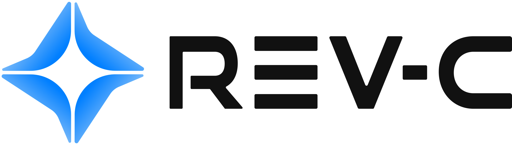

# 株式会社REV-C 企業情報リポジトリ

<div align="center">



**AIで会社を変える。日本の競争力を覚醒させる。**

[](LICENSE)
[](identity/corporate-identity.yaml)
[](https://company.rev-c.com/)

</div>

## 🏢 会社概要

株式会社REV-Cは、AI技術を活用して中小企業の変革と成長を支援する革新的な企業です。私たちは「AIで会社を変える。日本の競争力を覚醒させる。」を企業理念に掲げ、2030年までに中小企業AI革命の旗手として日本経済の再生を目指しています。

## 📋 このリポジトリについて

このリポジトリは、株式会社REV-Cの企業アイデンティティ、ロゴ、その他重要な企業情報を透明性を持って公開するためのものです。

### 📁 構成

```
📂 revc_details/
├── 📂 identity/           # 企業アイデンティティ
│   └── 📄 corporate-identity.yaml
├── 📂 logo/              # 企業ロゴ・ブランドアセット
│   ├── 🖼️ rev_star_black.png
│   ├── 🖼️ rev_star_white.png
│   ├── 🖼️ rev_star_gradient.png
│   └── 🖼️ [その他ロゴバリエーション]
└── 📄 README.md          # このファイル
```

## 🎯 企業アイデンティティ

### 企業理念
**「AIで会社を変える。日本の競争力を覚醒させる。」**

### ミッション
**「AIで中小企業を最強化し、大手企業を追い抜く競争力を創造する」**

### ビジョン
**「2030年、中小企業AI革命の旗手として日本の競争力を再生させる」**

### パーパス
**「『できない』の壁をAIで破り続け、不可能を可能にする新時代を創る」**

> 詳細は [`identity/corporate-identity.yaml`](identity/corporate-identity.yaml) をご確認ください。

## 🚀 事業内容

### 三位一体戦略

1. **AI教育 (AI Tutor)**
   - 中小企業向けAIリテラシー向上プログラム
   - 実践的なAI活用スキル習得支援

2. **AI戦略 (AI Strategy)**
   - 企業課題に特化したAI導入戦略立案
   - 実行可能な変革ロードマップ作成

3. **AI開発 (AI Development)**
   - カスタムAIソリューション開発
   - 導入後の継続的サポート・改善

## 🎨 ブランドガイドライン

### ロゴ使用について

本リポジトリのロゴファイルは、以下の目的での使用を歓迎します：

- 📰 報道・記事での使用
- 🤝 パートナーシップ紹介
- 📚 学術・研究目的
- 💼 取引先での紹介資料

### 利用可能なロゴ

- **スタンダード**: `rev_star_black.png` / `rev_star_white.png`
- **グラデーション**: `rev_star_gradient.png`
- **バーティカル**: `rev_star_vertical_*.png`
- **ホリゾンタル**: `rev_star_gradient_horizontal_*.png`

## 📞 お問い合わせ

### ウェブサイト
🌐 [https://company.rev-c.com/](https://company.rev-c.com/)

### 事業に関するお問い合わせ
- AI教育・研修のご相談
- AI戦略立案のご依頼  
- AIシステム開発のご相談
- 講演・メディア出演のご依頼

お気軽にウェブサイトからお問い合わせください。

## 🤝 パートナーシップ

私たちは、日本の中小企業を共に支援していただけるパートナーを常に求めています：

- **技術パートナー**: AI・IT企業との協業
- **教育パートナー**: 研修機関・大学との連携
- **事業パートナー**: 中小企業支援組織との協力

## 📈 目標・KPI

- **2030年目標**: 中小企業AI活用率No.1企業
- **社会的インパクト**: 日本経済の競争力再生への貢献

## 📄 ライセンス

このリポジトリの内容は、適切な利用目的での使用を前提として公開しています。商用利用や詳細な利用条件については、お問い合わせください。

---

<div align="center">

**🌟 一緒に日本の未来を変えませんか？ 🌟**

[](https://company.rev-c.com/)

*Last updated: December 2024*

</div> 